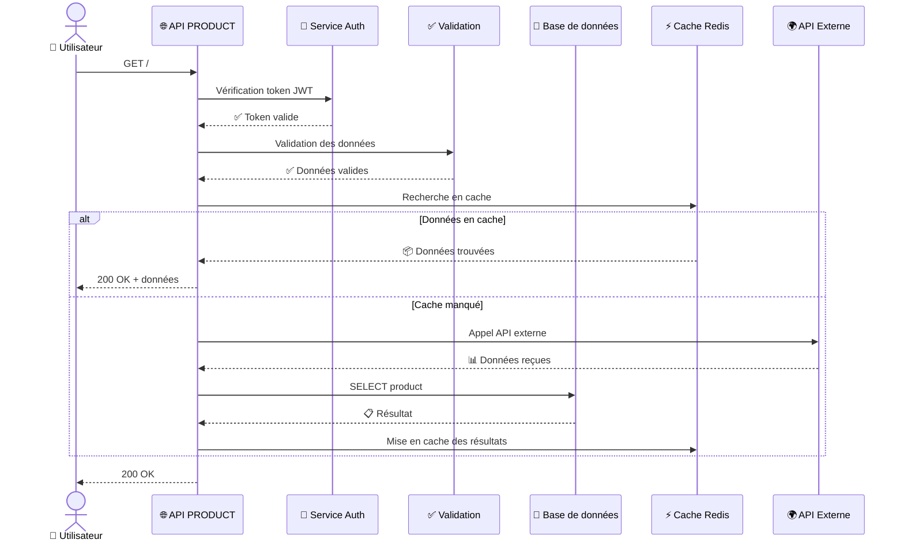
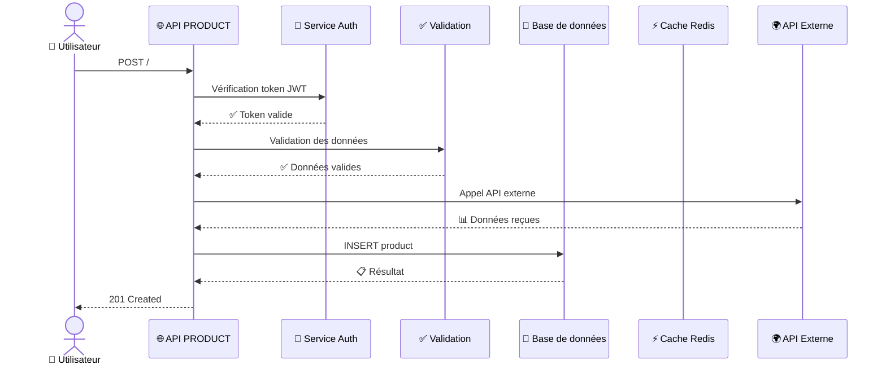

# Module Product

Ce module gère les opérations liées aux **products**. Il contient 2 endpoint(s).

## Vue d'ensemble

| Méthode | Route | Description |
|---------|-------|-------------|
| 📖 **GET** | `/` | 📖 Voici la description attendue :

"Récupère les informations de base sur le... |
| ➕ **POST** | `/` | ➕ "Envoi d'une nouvelle demande de produit authentifiée et validée, stockée d... |

---

## 📖 GET /

### 📋 Description

📖 Voici la description attendue :

"Récupère les informations de base sur les produits en authentifiant l'utilisateur et en vérifiant les données de saisie."

**Complexité:** 🔴 Complexe

**Services utilisés:** auth.middleware, validation.middleware

### 🔄 Flux d'exécution

### 📋 Étapes détaillées

- Étape 1: Vérification du token JWT : Le middleware `auth.middleware` vérifie si le token JWT est présent et valide dans la requête.
- Étape 2: Validation des données d'entrée : Le middleware `validation.middleware` vérifie les données de saisie pour s'assurer qu'elles sont correctes et conformes aux attentes du système.
- Étape 3: Authentification de l'utilisateur : L'endpoint utilise l'information stockée dans la base de données pour authentifier l'utilisateur en fonction des informations fournies par le token JWT.
- Étape 4: Récupération des informations de produits : Une fois l'utilisateur authentifié, l'endpoint récupère les informations de produits à partir de la base de données.
- Étape 5: Stockage dans le cache : Les informations de produits sont stockées dans le cache pour une utilisation future et réduction du temps d'accès.

---

## ➕ POST /

### 📋 Description

➕ "Envoi d'une nouvelle demande de produit authentifiée et validée, stockée dans la base de données et mise en cache, avec appel à une API externe."

**Complexité:** 🔴 Complexe

**Services utilisés:** auth.middleware, validation.middleware

### 🔄 Flux d'exécution

### 📋 Étapes détaillées

