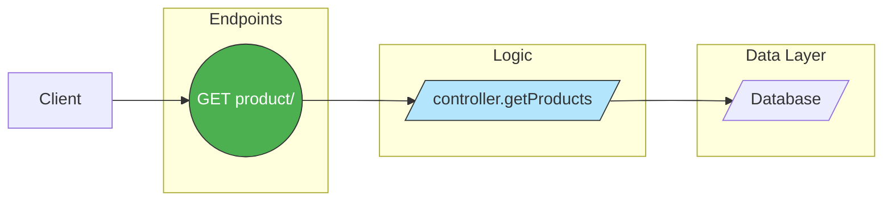
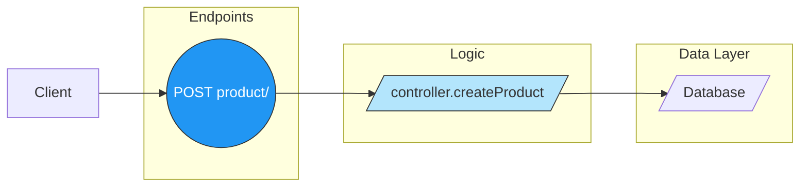

# Architecture de l'API

Cette page est générée automatiquement à partir du code source du projet. Elle présente les principaux diagrammes d'architecture, assurant ainsi une documentation toujours à jour.

---

## Diagramme du service : Product - Route GET /

## Diagramme du service : Product - Route POST /

